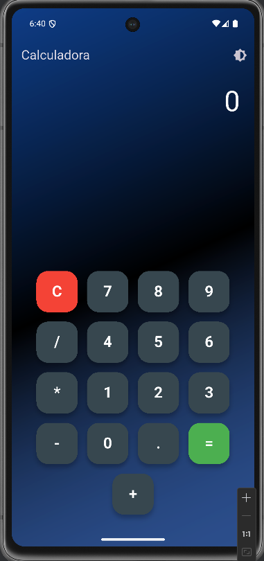

# Calculadora Flutter

Uma calculadora simples e estilosa feita com Flutter, com suporte a tema claro/escuro, fundo gradiente animado e histórico de operações.

---

## Funcionalidades

- Alternância entre tema claro e escuro
- Fundo animado com gradiente azul
- Botões arredondados e bem organizados
- Operações básicas: +, −, ×, ÷
- Histórico das últimas 3 expressões

---

## Tecnologias

- Flutter
- Dart
- math_expressions

---

## Print do aplicativo



## Como usar

1. Clone o repositório:
   ```bash
   git clone https://github.com/seu-usuario/calculadora_flutter.git
   cd calculadora_flutter
2. Instale as dependências:
    flutter pub get
3. Execute o app:
   flutter run


## Estrutura 
   ```bash
lib/
 └── main.dart               # Código principal
     pubspec.yaml            # Dependências
     assets/                 # (fontes ou imagens)
